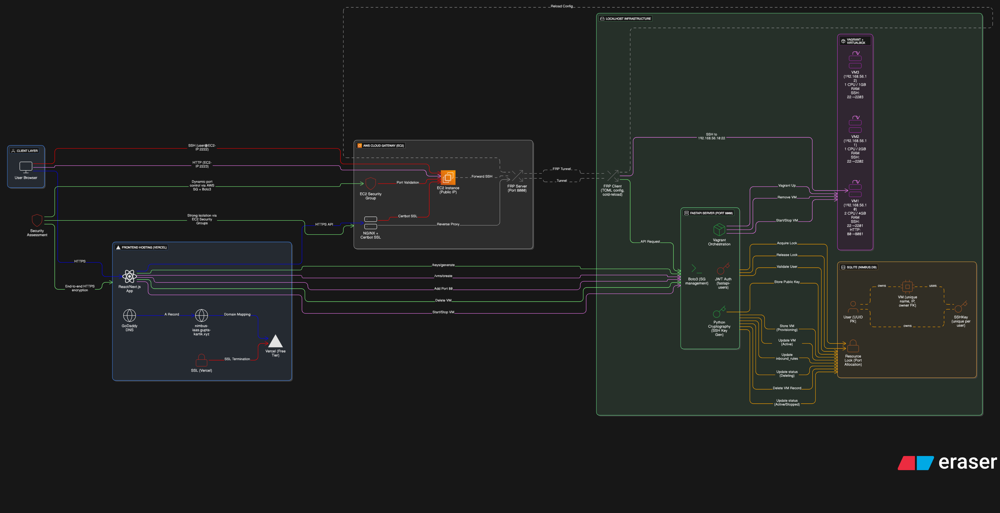

# 🌩️ Nimbus-IaaS


Nimbus-IaaS is a lightweight **Infrastructure as a Service (IaaS)** platform that allows you to create, manage, and expose local VirtualBox VMs to the internet through a modern web interface. It mimics cloud-like VM provisioning and management while running entirely on your machine.

---

## Table of Contents

- [About The Project](#about-the-project)
- [Key Features](#key-features)
- [System Architecture](#system-architecture)
- [Tech Stack](#tech-stack)
- [Getting Started](#getting-started)
  - [Prerequisites](#prerequisites)
  - [Setup](#setup)
- [API Reference](#api-reference)
- [Roadmap](#roadmap)
- [Contributing](#contributing)
- [License](#license)

---

## About The Project

Nimbus-IaaS bridges the gap between **local development** and **global accessibility**. Using **Vagrant** and **VirtualBox**, it provisions VMs on your local PC. The **FRP (Fast Reverse Proxy)** tunnel exposes each VM to a public-facing port, allowing secure access without expensive cloud infrastructure.

A **FastAPI backend** manages authentication, VM orchestration, SSH keys, and firewall rules, while a **React frontend** provides a responsive, cloud-like UI for managing your local infrastructure.

All communications are secured with **HTTPS** and **SSL/TLS**, and network access is controlled via **AWS Security Groups** for any tunneled ports.

---

## Key Features

- 🖥️ **Full VM Lifecycle Management**: Create, start, stop, and delete VMs directly from the web UI.
- 🔑 **SSH Key Management**: Generate or manage SSH key pairs for secure VM access.
- 🌐 **Global Accessibility**: Each VM is exposed via a public IP and port, securely tunneled through FRP.
- 🔒 **Dynamic Firewall Control**: Add or remove inbound rules for each VM in real-time; rules automatically sync with AWS Security Groups.
- 📜 **Provisioning Scripts**: Bootstrap VMs with custom shell scripts on creation.
- ✨ **Modern UI**: Clean, responsive, and intuitive interface built with React and Tailwind CSS.

---

## System Architecture

The architecture of Nimbus-IaaS is designed to emulate cloud-like VM provisioning while running locally:



**Highlights:**

- **Frontend (Vercel)**: Hosted with a custom domain and SSL for HTTPS access.
- **Cloud Gateway (EC2)**: Acts as a reverse proxy and secure entry point, managing FRP tunneling.
- **Backend (FastAPI)**: Runs locally, orchestrates VM creation, SSH keys, and dynamic firewall rules.
- **Local VMs (Vagrant + VirtualBox)**: VMs are provisioned locally and exposed publicly through FRP tunnels.

**Security Highlights:**

- End-to-end HTTPS/TLS encryption
- JWT-based authentication for users
- Per-user SSH key management
- EC2 Security Groups control exposed ports
- FRP tunnels hide local infrastructure

---

## Tech Stack

### Backend

- **Python** with **FastAPI**
- **Vagrant** for VM provisioning
- **Oracle VirtualBox** for virtualization
- **FRP (Fast Reverse Proxy)** for public tunneling
- **Boto3** for AWS Security Group management
- **SQLite + SQLAlchemy** for VM and user data storage

### Frontend

- **React (Vite)**
- **Tailwind CSS** for styling
- **Axios** for API communication

---

## Getting Started

### Prerequisites

- **Python 3.8+**
- **Node.js 16+ and npm**
- **Vagrant**
- **Oracle VirtualBox**
- **FRP Server** running on a cloud instance (e.g., AWS EC2)
  - Ensure the EC2 security group allows traffic on the FRP port (default 7000) and the range of VM ports (e.g., 2222-3000)
- **AWS CLI** configured with credentials that can manage EC2 Security Groups

### Setup

1. **Clone the repository**
```bash
git clone https://github.com/Gupta-Kartik7658/Nimbus-IaaS.git
cd Nimbus-IaaS
```

2. **Backend Setup**
```bash
python -m venv venv
source venv/bin/activate  # Windows: venv\Scripts\activate
pip install -r requirements.txt

# Configure frpc.toml with your FRP server public IP
uvicorn main:app --reload
```

The backend runs at `http://127.0.0.1:8000`.

3. **Frontend Setup**
```bash
cd nimbus-iaas-frontend
npm install
npm run dev
```

The frontend is available at `http://localhost:8080`.

---

## API Reference

| Method | Path | Description |
|--------|------|-------------|
| GET | `/list-vms` | List all managed VMs |
| POST | `/create-vm` | Create a new VM |
| DELETE | `/delete-vm/{username}` | Destroy a VM and clean up its resources |
| POST | `/start-vm/{username}` | Boot up an existing VM |
| POST | `/stop-vm/{username}` | Gracefully shut down a VM |
| GET | `/list-keys` | List all public SSH keys |
| POST | `/generate-key/{key_name}` | Generate a new RSA SSH key pair |
| GET | `/download/{key_name}` | Download the private key |
| POST | `/add-inbound-rule/{port}` | Add a new firewall rule/tunnel to a VM |
| DELETE | `/remove-inbound-rule/{username}/{remote_port}` | Remove a firewall rule from a VM |

---

## Roadmap

- [ ] User authentication (multi-user support)
- [ ] Real-time VM resource monitoring (CPU/RAM)
- [ ] Docker container support
- [ ] Enhanced Vagrant/provisioning logs in UI
- [ ] VM snapshot management (create/restore)

See [open issues](https://github.com/Gupta-Kartik7658/Nimbus-IaaS/issues) for details.

---

## Contributing

Nimbus-IaaS is open source. If you want to contribute, you can fork the repo and start right away, or raise an issue if you encounter a bug or have suggestions.

---

## License

Distributed under the MIT License. See `LICENSE.txt` for details.
